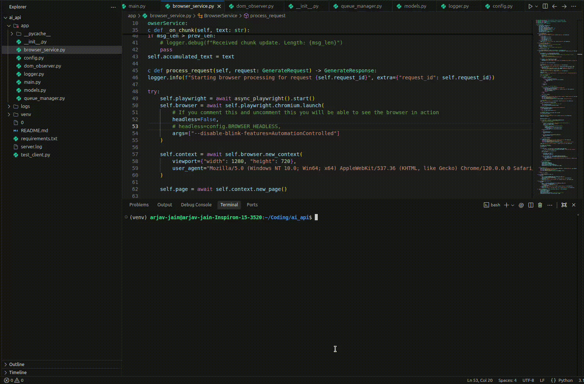

# GhostAPI

A FastAPI-based service that automates interactions with ChatGPT using Playwright.

## Features

- **Automated Browser Control**: Uses Playwright to navigate to ChatGPT, handle prompts, and capture responses.
- **Robustness**: Handles page loads, potential pop-ups (e.g., "Stay logged out"), and dynamic UI changes.
- **Streaming Support**: Captures streamed responses in real-time using a custom DOM observer.
- **Concurrency**: Manages multiple browser instances via a `QueueManager`.
- **Debugging**: Captures HTML snapshots and screenshots on failure.

## Demo



## Setup

1.  **Clone the repository**:
    ```bash
    git clone <repository_url>
    cd ai_api
    ```

2.  **Create a virtual environment**:
    ```bash
    python3 -m venv venv
    source venv/bin/activate
    ```

3.  **Install dependencies**:
    ```bash
    pip install -r requirements.txt
    playwright install chromium
    ```

## Docker Deployment

You can deploy the service using Docker:

1.  **Build the Docker image**:
    ```bash
    docker build -t ai-api .
    ```

2.  **Run the container**:
    ```bash
    docker run -d -p 8000:8000 --name ai-api-container ai-api
    ```
    
    The API will be available at `http://localhost:8000`.

## Usage

1.  **Start the server**:
    ```bash
    uvicorn app.main:app --host 0.0.0.0 --port 8000
    ```

2.  **Send a request**:
    ```bash
    curl -X POST "http://localhost:8000/generate" \
         -H "Content-Type: application/json" \
         -d '{"prompt": "What represents the spirit of Paris?"}'
    ```

    The response will contain the generated text and metadata.

## Configuration

Configuration is managed in `app/config.py`. Key settings include:
- `MAX_CONCURRENT_BROWSERS`: Number of parallel browser instances.
- `BROWSER_HEADLESS`: Run browsers in headless mode (default: False for debugging).
- `TIMEOUT_GENERATION_START`: Time to wait for generation to begin.

## Troubleshooting

- **Logs**: Check `server.log` (if redirected) or console output for detailed execution logs.
- **Screenshots/Snapshots**: On failure, artifacts are saved to `logs/screenshots` and `logs/html`.
